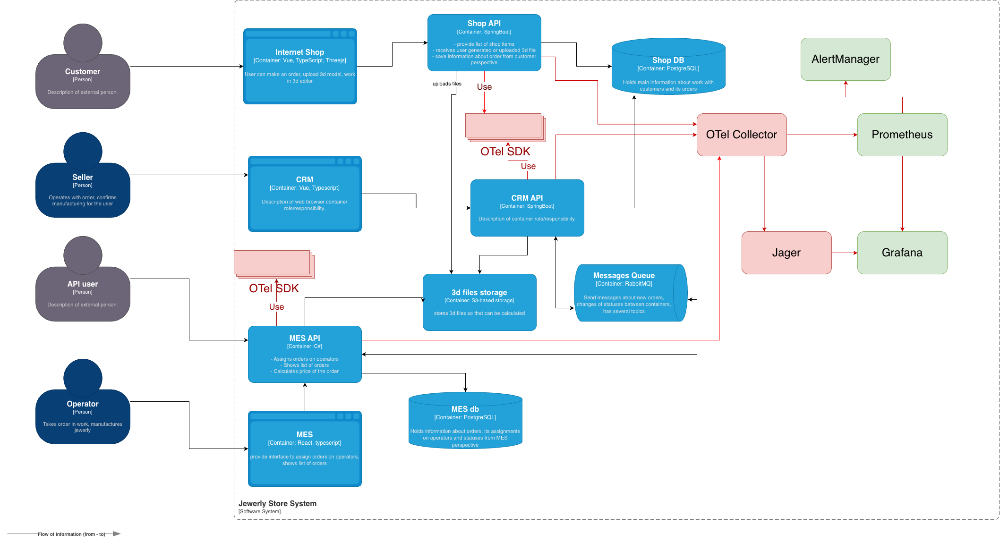

# Архитектурное решение по трейсингу

## Мотивация

- Частые жалобы на "пропавшие" заказы и зависания статусов. Необходимо видеть сквозной путь заказа и точную стадию.
- Трейсинг даст видимость сквозных операций, быструю локализацию узких мест, доказуемые SLO по времени расчёта и смене статусов.
- Метрики, на которые повлияет внедрение:
  - p95 времени расчёта цены и доставки события статуса
  - доля заказов со "зависшим" статусом > 24 часов
  - точность и скорость согласование между системами

## Где может "сломаться" или зависнуть заказ

- Интернет‑магазин создание заказа, загрузка 3D‑файла
- В связке Shop API -> RabbitMQ
- В CRM API при обработка событий
- В MES API при постановке в очередь расчёта, длительная обработка модели
- В Очереди RabbitMQ при потеря/дублирование, DLQ, задержка доставки, неидемпотентных консюмерах
- В S3 при загрузка или доступе к 3D‑файлам
- В БД транзакции и фиксация статусов

## Какие данные писать в трейсы

- Корреляционные идентификаторы, такие как trace id, span id, order id, external order id, message id
- Атрибуты, такие как source, customer id/partner id, status from/to
- Время, отправка/получение сообщения, время в очереди, время обработки воркером, подтверждение статуса
- Результат, success/failure, код ошибки/исключение, ретраи, маршрут DLQ

## Предлагаемое решение

- Внедрить OpenTelemetry SDK в Shop API, CRM API, MES API, OTel Collector, экспорт в Jaeger, метрики в Prometheus, отображение в Grafana
- Корреляция через заголовки W3C Trace Context (traceparent) и передачу их в сообщения RabbitMQ (headers). Все события содержат order_id и idempotency_key
- Трейс‑линки между синхронными HTTP и асинхронными спанами очередей

## Компромиссы

### Ограничения и когда трейсинг не поможет

- Закрытые проприетарные части MES без SDK потребуют обёрток/агентов; часть внутренних библиотек может быть дорого дорабатывать
- Не решает проблему отсутствия идемпотентности и гарантий доставки без внедрения outbox/inbox

## Безопасность

- Аутентификация к системе трейсинга через корпоративный SSO, c ролями Поддержка (read), Разработчики (read/write конфигураций), Админы.
- Сетевой доступ ограничен VPN/VPC, приватные эндпоинты и шифрование, ретеншн трейс‑данных по политикам
- Маскирование данные в атрибутах

## Автоматический мониторинг и алертинг

- Обнаружение "зависших" заказов по отсутствию новых спанов > N минут
- Экспорт агрегатов в Prometheus через OTel Collector
- Алерты при нарушениях SLO, росте времени в очереди, доле неуспешных спанов
- Создание инцидента, включение rate‑limiting для партнёров
