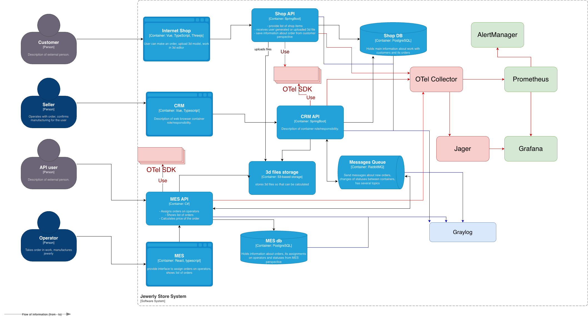

# Архитектурное решение по логированию

## Мотивация

- Сейчас инциденты разбираются "со слов клиента". Логирование позволит быстро воспроизводить события, анализировать первопричины и снижать нагрузку на поддержку.
- Влияние на бизнес-метрики
  - Время восстановления после сбоя, быстрый анализ возникших проблем
  - Доля инцидентов, решённых без эскалации к разработке
  - Точность и скорость расследований при злоупотреблении API
  - Стоимость инфраструктуры (за счёт оптимизации по данным логов)

## Предлагаемое решение

Предлагается добавить в инфраструктуру системы аггрегатор логов Logstash, либо Graylog.

### Системы для сбора логов

- Shop API, CRM API, MES API, воркеры MES (pricing), RabbitMQ (брокерные логи/метрики), S3 access logs, БД (slow query logs)
- Приоритетные логи это поток заказа: создание -> расчёт -> производство -> отгрузка. Эти логи нужны одновременно с трейсингом, чтобы коррелировать события

### Какие логи собирать и где

- HTTP запросы. Метод, путь, статус, латентность, размер, user id/client id, trace id
- Доменные события заказов. Переход статуса, причина, инициатор, order id, trace id
- Очереди. Публикация, получение, queue, routing key, message id, trace id, попытка, причина DLQ
- Воркеры по вычислению цены. Cтарт/финиш задачи, размер/сложность модели, длительность этапов, результат
- Базы данных. Медленные запросы, ошибки соединений/таймауты, рост времени выполнения
- Хранилище файлов. Успешные/ошибочные операции upload/download с размерами и временем

## Список логов уровня INFO

- Создание заказа. Данные: `time, order id, customer id/partner id, source`
- Загрузка файла в S3. Данные: `time, order id, file id, size, hash, uploader`
- Отравка заказа. Данные: `time, order id, count, total, channel`
- Изменение статуса заказа. Данные: `time, order id, from, to, initiator, reason`
- Публикация события в очереди. Данные: `time, order id, event type, topic, message id`
- Обработка события в очереди. `time, order id, event type, queue, handler, duration(ms)`
- Обработка HTTP запроса. Данные: `service, method, path, status, duration(ms), user/client, trace id`

## Уровни логирования и правила

- _DEBUG_: детальные технические сведения (выключено по умолчанию, включается точечно feature‑флагом)
- _INFO_: бизнесовые и операционные события потока заказа (по умолчанию включено)
- _WARN_: временные деградации, ретраи, превышение порогов, частично восстановленные ошибки
- _ERROR_: ошибки запросов, отказ обработки сообщения, DLQ, невозможность обновить статус
- _FATAL_: недоступность критичных зависимостей при старте

## Безопасность логов

- Доступ по SSO с ролями Support/Dev/Admin, c принципом минимальных привилегий
- Приватные сети и ретеншн согласно политике
- Маскирование персональных данных

## Политика хранения

- Отдельные индексы/лог‑стримы для сервисов
- Ретеншн логов от 30 до 90 дней
- Ротация и архивация логов

## Анализ логов

- Стоит настроить алертинг на след. события
  - аномальному рост ERROR/WARNб DLQ‑событий
  - всплеск 5xx ошибок
  - аномальный RPS
