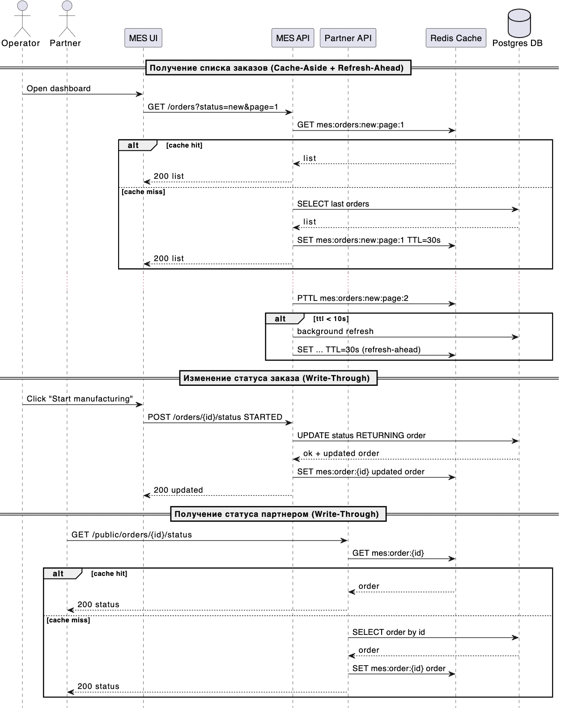

# Архитектурное решение по кешированию

## Мотивация

- Пользователи MES жалуются на медленную загрузку главной страницы со списком заказов
- Партнеры и B2C жалуются на длительное ожидание расчета и обработки

## Предлагаемое решение

Ускорить чтение списков заказов для операторов, разгрузить БД и API за счет кэширования, стабилизировать пики нагрузки, не нарушая консистентность статусов

1. Серверное кеширование на уровне MES API (и частично Shop/CRM API для публичных списков)
2. Ограниченное клиентское кеширование браузером

### Реализация серверного кэширования

В качестве хранилище кеша использовать Redis, с применением паттерна Cache‑Aside + Refresh‑Ahead для чтений данных, например списка заказов и Write-Through для получения статуса заказа.

#### Почему Cache‑Aside?

Устойчивость к сбоям кеша - если сервер кеша выходит из строя, система всё равно может работать, обращаясь напрямую к базе данных.
Модель данных в кеше может отличаться от модели данных в БД
Это позволяет выполнить запрос к БД, объединяющий несколько таблиц, и сохранить его в кеше под одним ключом. Так можно избежать дальнейшего выполнения сложной логики.

#### Почему Refresh‑Ahead?

- Низкая стоимость чтения данных из БД
- Согласованность записей кеша, к которым часто обращаются пользователи
- Высокая чувствительность к задержкам

#### Почему Write-Through?

Данные между кешем и базой данных всегда будут синхронизированы. Это исключает возможность неконсистентности кеша и его инвалидацию.

## Стратегия инвалидации

- По ключу при событиях смены статуса `order:{id}` (Write-Through)
- Временная (TTL) - 15-60 секунд для списков, 1-5 минут для справочников, 30 секунд для агрегатов, с jitter для "распыления" инвалидаций (Cache‑Aside + Refresh‑Ahead)
- Возможность принудительной очистки при инцидентах

## Сравнение стратегий

| Стратегия     | Плюсы                                              | Минусы                 | Где применяем     |
| ------------- | -------------------------------------------------- | ---------------------- | ----------------- |
| Cache‑Aside   | Простота, контроль инвалидации, нет лишних записей | Первое чтение холодное | Списки, карточки  |
| Write‑Through | Консистентность, теплый кэш                        | Нагрузка на запись     | Счетчики/агрегаты |
| Refresh‑Ahead | Меньше холодных промахов                           | Сложность прогрева     | Горячие списки    |

## Технологии и настройки

- Redis cluster
- Keyset‑пагинация - храним страницы как `orders:{status}:page:{cursor}`
- Серилизация JSON, компрессия для больших страниц
- Аудит. метрики cache hit/miss, время сгенерировать страницу без кэша, частота инвалидаций
